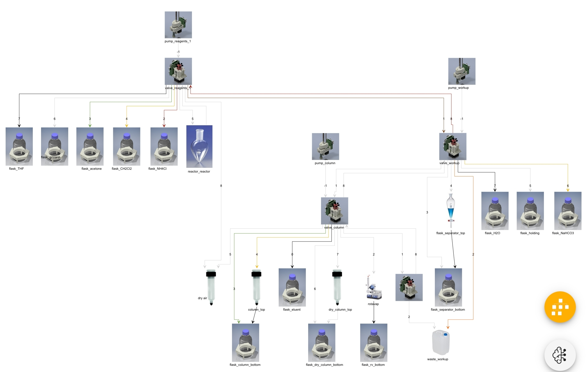
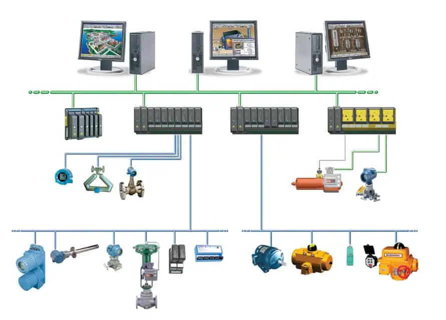

(graph)=
# 实验室组态图

组态(configuration)图是指在自动化领域中，用来描述和展示控制系统中各个组件之间关系的图形化表示方法。
它是一个系统的框架图，通过图形符号和连接线，将各个组件（如传感器、执行器、控制器等）以及它们之间的关系进行可视化展示。

Uni-Lab 的组态图当前支持 node-link json 和 graphml 格式，其中包含4类重要信息：

* 单个设备/物料配置，即图中节点的参数；
* 父子关系，如一台工作站包含它的多个子设备、放置着多个物料耗材；
* 物理连接关系，如流体管路连接、AGV/机械臂/直线模组转运连接。
* 通信转接关系，如多个 IO 设备通过 IO 板卡或 PLC 转为 Modbus；串口转网口等
* 控制逻辑关系，如某个输出量被某个输入量 PID 控制

## 父子关系、物质流与"编译"操作

在计算机操作系统下，软件操作数据和文件。在实验操作系统下，实验“软件”利用仪器“硬件”操作物质。实验人员能理解的操作，最终都是对物质的处理。将实验步骤，转化为硬件指令，这个操作我们可以类比为“编译”。

对用户来说，“直接操作设备执行单个指令”不是个真实需求，真正的需求是**“执行对实验有意义的单个完整动作”——加入某种液体多少量；萃取分液；洗涤仪器等等。就像实验步骤文字书写的那样。**

而这些对实验有意义的单个完整动作，**一般需要多个设备的协同**，还依赖于他们的**物理连接关系（管道相连；机械臂可转运）**。
于是 Uni-Lab 实现了抽象的“工作站”，即注册表中的 `workstation` 设备（`ProtocolNode`类）来处理编译、规划操作。以泵骨架组成的自动有机实验室为例，设备管道连接关系如下：



接收“移液”动作，编译为一系列泵指令和阀指令

```text
Goal received: {
    'from_vessel': 'flask_acetone', 
    'to_vessel': 'reactor', 
    'volume': 2000.0, 
    'flowrate': 100.0
}, running steps: 
```

```JSON
[
{
    "device_id": "pump_reagents", 
    "action_name": "set_valve_position", 
    "action_kwargs": {"command": "3"}
}, 
{
    "device_id": "pump_reagents",   
    "action_name": "set_position", 
    "action_kwargs": {
        "position": 2000.0, 
        "max_velocity": 100.0
    }
}, 
{
    "device_id": "pump_reagents", 
    "action_name": "set_valve_position", 
    "action_kwargs": {"command": '5'}
}, 
{
    "device_id": "pump_reagents", 
    "action_name": "set_position", 
    "action_kwargs": {
        "position": 0.0, 
        "max_velocity": 100.0
    }
}
]
```

若想开发新的“编译”/“规划”功能，在 `unilabos/compilers` 实现一个新函数即可。详情请见 [添加新实验操作（Protocol）](../developer_guide/add_protocol.md)

## 通信转接关系

Uni-Lab 秉持着**通信逻辑**与**业务逻辑**分离的设计理念，以追求实验设备、通信设备最大的代码复用性。

如对 IO 板卡8路 IO 控制的8个电磁阀，经过设备抽象层后，仅有逻辑意义上分立的8个电磁阀。在组态图中，他们通过代表通信关系的边（edge）与 IO 板卡设备相连，边的属性包含 IO 地址。
在实际使用中，对抽象的电磁阀发送开关动作请求，将通过 Uni-Lab 设备抽象&通信中间件转化为对 IO 板卡发送 IO 读写指令。因此一定意义上，组态图的通信转接部分代表了简化的电气接线图。

代码架构上，实验设备位于 Uni-Lab 仓库/注册表的 `devices` 目录，通信设备位于 Uni-Lab 仓库/注册表的 `device_comms` 目录。


