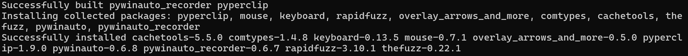
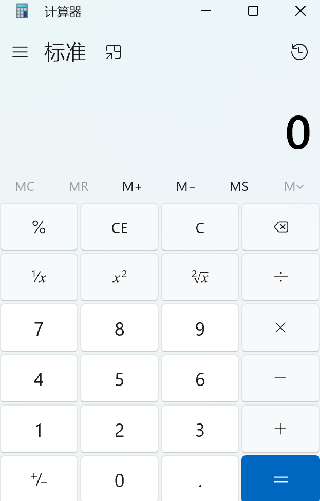
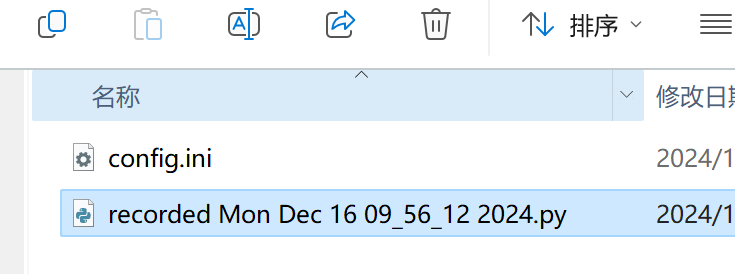
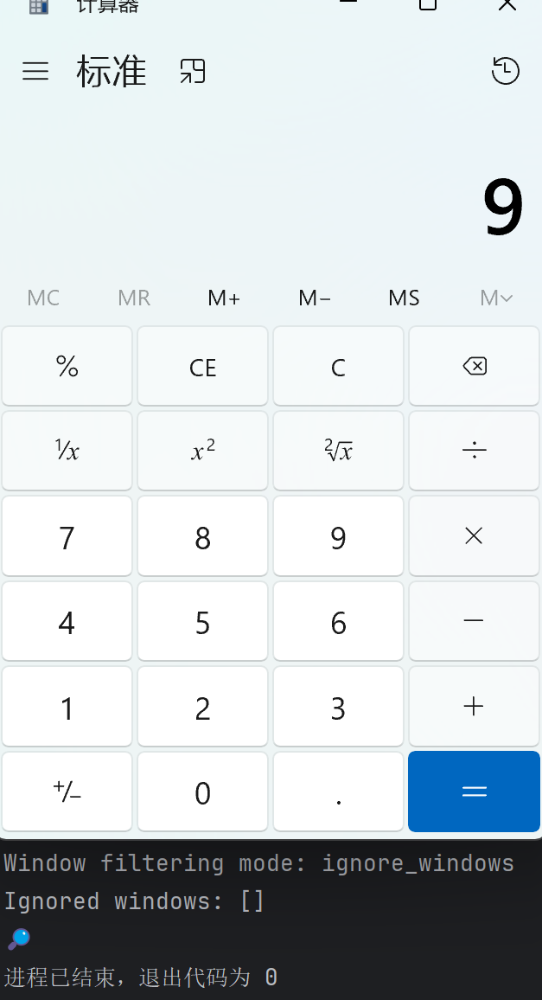

# 设备 Driver 开发

我们对设备 Driver 的定义，是一个 Python/C++/C# 类，类的方法可以用于获取传感器数据、执行设备动作、更新物料信息。它们经过 Uni-Lab 的通信中间件包装，就能成为高效分布式通信的设备节点。

因此，若已有设备的 SDK (Driver)，可以直接 [添加进 Uni-Lab](add_device.md)。仅当没有 SDK (Driver) 时，请参考本章作开发。

## 有串口字符串指令集文档的设备：Python 串口通信（常见 RS485, RS232, USB）

开发方式：对照厂家给出的指令集文档，实现相应发送指令字符串的 python 函数。可参考 [注射泵串口驱动样例](https://github.com/TablewareBox/runze-syringe-pump)

## 常见工业通信协议：Modbus（RTU, TCP）

Modbus 与 RS485、RS232 不一样的地方在于，会有更多直接寄存器的读写，以及涉及字节序转换（Big Endian, Little Endian）。

Uni-Lab 开发团队在仓库中提供了3个样例：

* 单一机械设备**电夹爪**，通讯协议可见 [增广夹爪通讯协议](https://doc.rmaxis.com/docs/communication/fieldbus/)，驱动代码位于 `unilabos/devices/gripper/rmaxis_v4.py`
* 单一通信设备**IO板卡**，驱动代码位于 `unilabos/device_comms/gripper/SRND_16_IO.py`
* 执行多设备复杂任务逻辑的**PLC**，Uni-Lab 提供了基于地址表的接入方式和点动工作流编写，测试代码位于 `unilabos/device_comms/modbus_plc/test/test_workflow.py`

****

## 其他工业通信协议：CANopen, Ethernet, OPCUA...

【敬请期待】

## 没有接口的老设备老软件：使用 PyWinAuto

**pywinauto**是一个 Python 库，用于自动化Windows GUI操作。它可以模拟用户的鼠标点击、键盘输入、窗口操作等，广泛应用于自动化测试、GUI自动化等场景。它支持通过两个后端进行操作：

* **win32**后端：适用于大多数Windows应用程序，使用native Win32 API。（pywinauto_recorder默认使用win32后端）
* **uia**后端：基于Microsoft UI Automation，适用于较新的应用程序，特别是基于WPF或UWP的应用程序。（在win10上，会有更全的目录，有的窗口win32会识别不到）

### windows平台安装pywinauto和pywinauto_recorder

直接安装会造成环境崩溃，需要下载并解压已经修改好的文件。

cd到对应目录，执行安装

`pip install . -i ``https://pypi.tuna.tsinghua.edu.cn/simple`



windows平台测试 python pywinauto_recorder.py，退出使用两次ctrl+alt+r取消选中，关闭命令提示符。

### 计算器例子

你可以先打开windows的计算器，然后在ilab的环境中运行下面的代码片段，可观察到得到结果，通过这一案例，你需要掌握的pywinauto用法：

* 连接到指定进程
* 利用dump_tree查找需要的窗口
* 获取某个位置的信息
* 模拟点击
* 模拟输入

#### 代码学习

```Python
from pywinauto import Application
import time

from pywinauto.findwindows import ElementAmbiguousError

# 启动计算器应用
app = Application(backend='uia').connect(title="计算器")

# 连接到计算器窗口
window = app["计算器Dialog0"]

# 打印窗口控件树结构，帮助定位控件
window.dump_tree(depth=3)
# 详细输出
"""
Dialog - '计算器'    (L-419, T773, R-73, B1287)
['计算器Dialog', 'Dialog', '计算器', '计算器Dialog0', '计算器Dialog1', 'Dialog0', 'Dialog1', '计算器0', '计算器1']
child_window(title="计算器", control_type="Window")
   | 
   | Dialog - '计算器'    (L-269, T774, R-81, B806)
   | ['计算器Dialog2', 'Dialog2', '计算器2']
   | child_window(title="计算器", auto_id="TitleBar", control_type="Window")
   |    | 
   |    | Menu - '系统'    (L0, T0, R0, B0)
   |    | ['Menu', '系统', '系统Menu', '系统0', '系统1']
   |    | child_window(title="系统", auto_id="SystemMenuBar", control_type="MenuBar")
   |    | 
   |    | Button - '最小化 计算器'    (L-219, T774, R-173, B806)
   |    | ['Button', '最小化 计算器Button', '最小化 计算器', 'Button0', 'Button1']
   |    | child_window(title="最小化 计算器", auto_id="Minimize", control_type="Button")
   |    | 
   |    | Button - '使 计算器 最大化'    (L-173, T774, R-127, B806)
   |    | ['Button2', '使 计算器 最大化', '使 计算器 最大化Button']
   |    | child_window(title="使 计算器 最大化", auto_id="Maximize", control_type="Button")
   |    | 
   |    | Button - '关闭 计算器'    (L-127, T774, R-81, B806)
   |    | ['Button3', '关闭 计算器Button', '关闭 计算器']
   |    | child_window(title="关闭 计算器", auto_id="Close", control_type="Button")
   | 
   | Dialog - '计算器'    (L-411, T774, R-81, B1279)
   | ['计算器Dialog3', 'Dialog3', '计算器3']
   | child_window(title="计算器", control_type="Window")
   |    | 
   |    | Static - '计算器'    (L-363, T782, R-327, B798)
   |    | ['计算器Static', 'Static', '计算器4', 'Static0', 'Static1']
   |    | child_window(title="计算器", auto_id="AppName", control_type="Text")
   |    | 
   |    | Custom - ''    (L-411, T806, R-81, B1279)
   |    | ['Custom', '计算器Custom']
   |    | child_window(auto_id="NavView", control_type="Custom")
   | 
   | Pane - ''    (L-411, T806, R-81, B1279)
   | ['Pane', '计算器Pane']
"""

# 通过控件路径（可参考下一小节路径）可以发现，本文档第48-50行是我们需要定位的控件
# 本文档第16-18行为其自身，即depth=1，我们要定位的第48-50行是depth=3的控件，从树来一级一级定位即可
# PyWinAuto为我们提供了非常便捷的取窗口方式，在每3行dump的内容中，第三行就是从上一级取出当前窗口的方式，直接复制即可
# 这里注意到，使用title="计算器", control_type="Window"进行匹配，会出现两个，因此指定found_index=1
sub_window = window.child_window(title="计算器", control_type="Window", found_index=1)
target_window = sub_window.child_window(auto_id="NavView", control_type="Custom")
target_window.dump_tree(depth=3)
"""
Custom - ''    (L-411, T806, R-81, B1279)
['标准Custom', 'Custom']
child_window(auto_id="NavView", control_type="Custom")
   | 
   | Button - '打开导航'    (L-407, T812, R-367, B848)
   | ['打开导航Button', '打开导航', 'Button', 'Button0', 'Button1']
   | child_window(title="打开导航", auto_id="TogglePaneButton", control_type="Button")
   |    | 
   |    | Static - ''    (L0, T0, R0, B0)
   |    | ['Static', 'Static0', 'Static1']
   |    | child_window(auto_id="PaneTitleTextBlock", control_type="Text")
   | 
   | GroupBox - ''    (L-411, T814, R-81, B1275)
   | ['标准GroupBox', 'GroupBox', 'GroupBox0', 'GroupBox1']
   |    | 
   |    | Static - '表达式为 '    (L0, T0, R0, B0)
   |    | ['表达式为 ', 'Static2', '表达式为 Static']
   |    | child_window(title="表达式为 ", auto_id="CalculatorExpression", control_type="Text")
   |    | 
   |    | Static - '显示为 0'    (L-411, T875, R-81, B947)
   |    | ['显示为 0Static', '显示为 0', 'Static3']
   |    | child_window(title="显示为 0", auto_id="CalculatorResults", control_type="Text")
   |    | 
   |    | Button - '打开历史记录浮出控件'    (L-121, T814, R-89, B846)
   |    | ['打开历史记录浮出控件', '打开历史记录浮出控件Button', 'Button2']
   |    | child_window(title="打开历史记录浮出控件", auto_id="HistoryButton", control_type="Button")
   |    | 
   |    | GroupBox - '记忆控件'    (L-407, T948, R-85, B976)
   |    | ['记忆控件', '记忆控件GroupBox', 'GroupBox2']
   |    | child_window(title="记忆控件", auto_id="MemoryPanel", control_type="Group")
   |    | 
   |    | GroupBox - '显示控件'    (L-407, T978, R-85, B1026)
   |    | ['显示控件', 'GroupBox3', '显示控件GroupBox']
   |    | child_window(title="显示控件", auto_id="DisplayControls", control_type="Group")
   |    | 
   |    | GroupBox - '标准函数'    (L-407, T1028, R-166, B1076)
   |    | ['标准函数', '标准函数GroupBox', 'GroupBox4']
   |    | child_window(title="标准函数", auto_id="StandardFunctions", control_type="Group")
   |    | 
   |    | GroupBox - '标准运算符'    (L-164, T1028, R-85, B1275)
   |    | ['标准运算符', '标准运算符GroupBox', 'GroupBox5']
   |    | child_window(title="标准运算符", auto_id="StandardOperators", control_type="Group")
   |    | 
   |    | GroupBox - '数字键盘'    (L-407, T1078, R-166, B1275)
   |    | ['GroupBox6', '数字键盘', '数字键盘GroupBox']
   |    | child_window(title="数字键盘", auto_id="NumberPad", control_type="Group")
   |    | 
   |    | Button - '正负'    (L-407, T1228, R-328, B1275)
   |    | ['Button32', '正负Button', '正负']
   |    | child_window(title="正负", auto_id="negateButton", control_type="Button")
   | 
   | Static - '标准'    (L-363, T815, R-322, B842)
   | ['标准', '标准Static', 'Static4']
   | child_window(title="标准", auto_id="Header", control_type="Text")
   | 
   | Button - '始终置顶'    (L-312, T814, R-280, B846)
   | ['始终置顶Button', '始终置顶', 'Button33']
   | child_window(title="始终置顶", auto_id="NormalAlwaysOnTopButton", control_type="Button")
"""
# 观察到GroupBox控件并没有提供默认的child_window，而list中的identifier均可作为best_match来索引
# ['标准GroupBox', 'GroupBox', 'GroupBox0', 'GroupBox1'] 这里选用第0项
group_box = target_window.child_window(best_match="标准GroupBox")
numpad = group_box.child_window(title="数字键盘", auto_id="NumberPad", control_type="Group")
numpad.dump_tree(depth=2)
"""
GroupBox - '数字键盘'    (L-334, T1350, R-93, B1547)
['GroupBox', '数字键盘', '数字键盘GroupBox']
child_window(title="数字键盘", auto_id="NumberPad", control_type="Group")
   | 
   | Button - '零'    (L-253, T1500, R-174, B1547)
   | ['零Button', 'Button', '零', 'Button0', 'Button1']
   | child_window(title="零", auto_id="num0Button", control_type="Button")
   | 
   | Button - '一'    (L-334, T1450, R-255, B1498)
   | ['一Button', 'Button2', '一']
   | child_window(title="一", auto_id="num1Button", control_type="Button")
   | 
   | Button - '二'    (L-253, T1450, R-174, B1498)
   | ['Button3', '二', '二Button']
   | child_window(title="二", auto_id="num2Button", control_type="Button")
   | 
   | Button - '三'    (L-172, T1450, R-93, B1498)
   | ['Button4', '三', '三Button']
   | child_window(title="三", auto_id="num3Button", control_type="Button")
   | 
   | Button - '四'    (L-334, T1400, R-255, B1448)
   | ['四', 'Button5', '四Button']
   | child_window(title="四", auto_id="num4Button", control_type="Button")
   | 
   | Button - '五'    (L-253, T1400, R-174, B1448)
   | ['Button6', '五Button', '五']
   | child_window(title="五", auto_id="num5Button", control_type="Button")
   | 
   | Button - '六'    (L-172, T1400, R-93, B1448)
   | ['六Button', 'Button7', '六']
   | child_window(title="六", auto_id="num6Button", control_type="Button")
   | 
   | Button - '七'    (L-334, T1350, R-255, B1398)
   | ['Button8', '七Button', '七']
   | child_window(title="七", auto_id="num7Button", control_type="Button")
   | 
   | Button - '八'    (L-253, T1350, R-174, B1398)
   | ['八', 'Button9', '八Button']
   | child_window(title="八", auto_id="num8Button", control_type="Button")
   | 
   | Button - '九'    (L-172, T1350, R-93, B1398)
   | ['Button10', '九', '九Button']
   | child_window(title="九", auto_id="num9Button", control_type="Button")
   | 
   | Button - '十进制分隔符'    (L-172, T1500, R-93, B1547)
   | ['十进制分隔符Button', 'Button11', '十进制分隔符']
   | child_window(title="十进制分隔符", auto_id="decimalSeparatorButton", control_type="Button")
"""
# 获取按钮 '9'
button_9 = numpad.child_window(title="九", auto_id="num9Button", control_type="Button")
# 利用相同的办法，我们也可以找到增加和等于号的控件
std_calc_panel = group_box.child_window(title="标准运算符", auto_id="StandardOperators", control_type="Group")
equal_operation = std_calc_panel.child_window(title="等于", auto_id="equalButton", control_type="Button")

# 模拟点击按钮 '9'
button_9.click_input()
# 键入：https://github.com/pywinauto/pywinauto/blob/atspi/pywinauto/windows/keyboard.py
# 模拟输入 '加号' 和 数字9
window.type_keys("{VK_ADD}9")
# 等于
equal_operation.click_input()
# 获取计算结果文本（显示在计算器窗口的文本框中）
result = group_box.child_window(auto_id="CalculatorResults", control_type="Text").window_text()
print(f"计算结果：{result[4:]}")  # 应当得到结果18
```

#### 依据像素判定状态

```Python
# 有时，你需要根据窗口的颜色判断是否可用，是否正在运行，可以使用pyautogui来实现这一功能
# pyautogui需要对应在环境中进行安装
point_x = int(control_view.rectangle().left + control_view.rectangle().width() * 0.15)
point_y = 15 + control_view.rectangle().top
r, g, b = pyautogui.pixel(point_x, point_y)
```

### pywinauto_recorder

pywinauto_recorder是一个配合 pywinauto 使用的工具，用于录制用户的操作，并生成相应的 pywinauto 脚本。这对于一些暂时无法直接调用DLL的函数并且需要模拟用户操作的场景非常有用。同时，可以省去仅用pywinauto的一些查找UI步骤。

#### 运行尝试

请参照 上手尝试-环境创建-3 开启pywinauto_recorder

例如我们这里先启动一个windows自带的计算器软件



在录制状态下点击数字键盘的“9”，随后退出录制，得到下图运行的文件。



```Python
# encoding: utf-8

from pywinauto_recorder.player import *

with UIPath(u"计算器||Window"):
    with UIPath(u"计算器||Window->||Custom->||Group->数字键盘||Group"):
        click(u"九||Button")
```

执行该python脚本，可以观察到新开启的计算器被点击了数字9



### `dump_tree`详解

`dump_tree`方法用于打印控件树结构，帮助我们快速了解应用程序窗口中的控件层级，尤其是在自动化测试或脚本开发中，识别控件非常重要。

```Python
window.dump_tree(depth=[int类型数字], filename=None)
# 打印当前窗口及其子控件的树结构
# 在debug的过程中，如果需要查找某一控件，可以通过depth指定为4~5，利用搜索查看是哪个独立控件
# 指定filename后将保存到对应目录文件中
```

输出会列出窗口的各个控件及其子控件，显示每个控件的属性（如标题、类型等）。

```Python
"""
GroupBox - '数字键盘'    (L-334, T1350, R-93, B1547)
['GroupBox', '数字键盘', '数字键盘GroupBox']
child_window(title="数字键盘", auto_id="NumberPad", control_type="Group")
   | 
   | Button - '零'    (L-253, T1500, R-174, B1547)
   | ['零Button', 'Button', '零', 'Button0', 'Button1']
   | child_window(title="零", auto_id="num0Button", control_type="Button")
"""
```

这里以上面计算器的例子对dump_tree进行解读

2~4行为当前对象的窗口

* 第2行分别是窗体的类型 `GroupBox`，窗体的题目 `数字键盘`，窗体的矩形区域坐标，对应的是屏幕上的位置（左、上、右、下）
* 第3行是 `['GroupBox', '数字键盘', '数字键盘GroupBox']`，为控件的标识符列表，可以选择任意一个，使用 `child_window(best_match="标识符")`来获取该窗口
* 第4行是获取该控件的方法，请注意该方法不能保证获取唯一，`title`如果是变化的，也需要删除 `title`参数

6~8行为当前对象窗口所包含的子窗口信息，信息类型对应2~4行

### 窗口获取注意事项

1. 在 `child_window`的时候，并不会立刻报错，只有在执行窗口的信息获取时才会调用，查询窗口是否存在，因此要想确定 `child_window`是否正确，可以调用子窗口对象的属性 `element_info`，来保证窗口存在